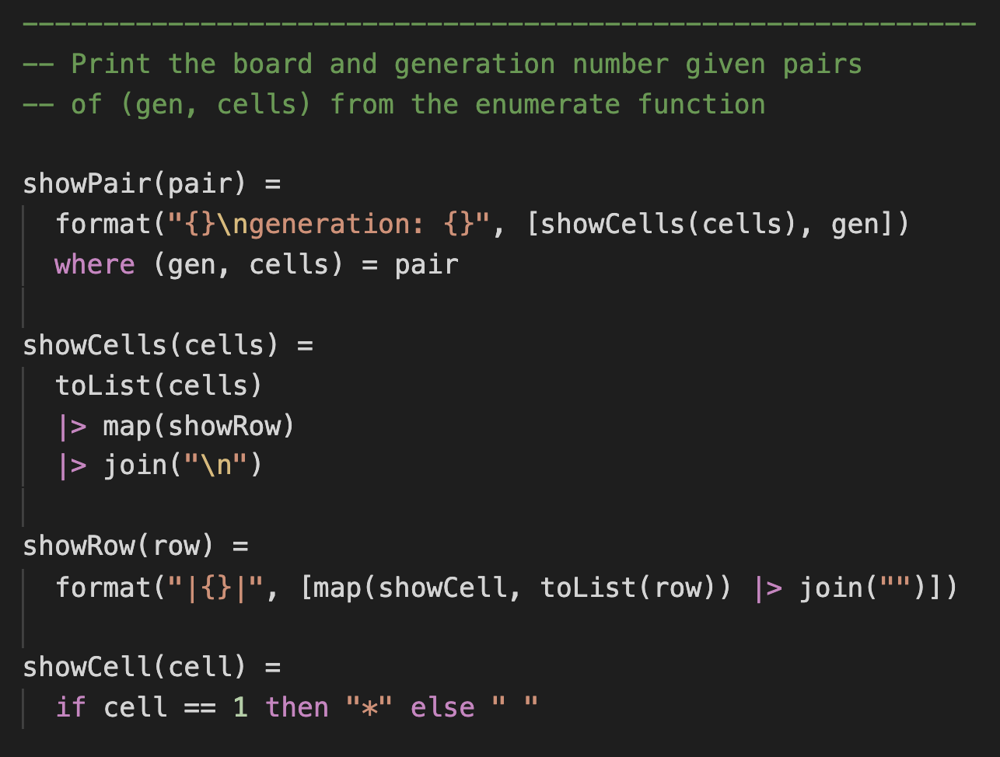

# pointless-syntax-highlighting

This extension provides simple syntax highlighting for [Pointless](https://ptls.dev/) in VS Code.

## Features

It highlights comments, keywords, literal values, etc.

This is what it looks like:

With this extension commenting out code sections (`Ctr + /` or `Cmd + /`) and paring parantheses/braces should also work.

